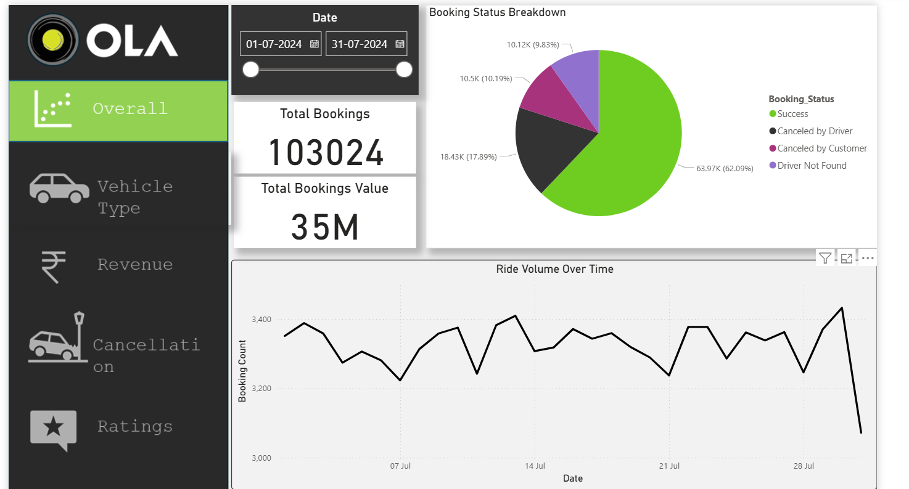
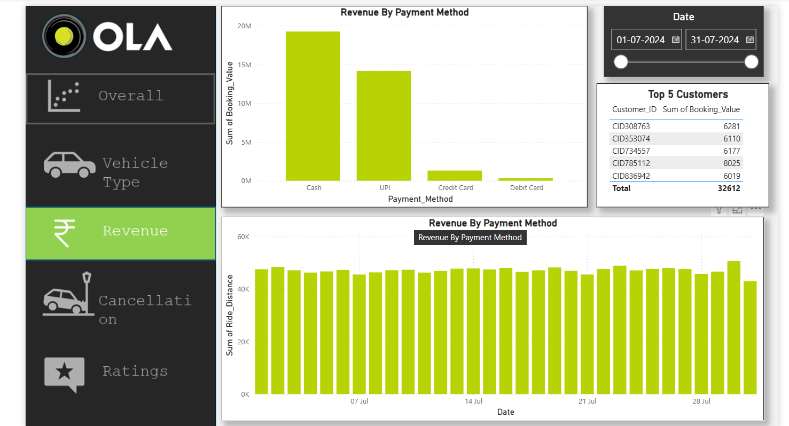
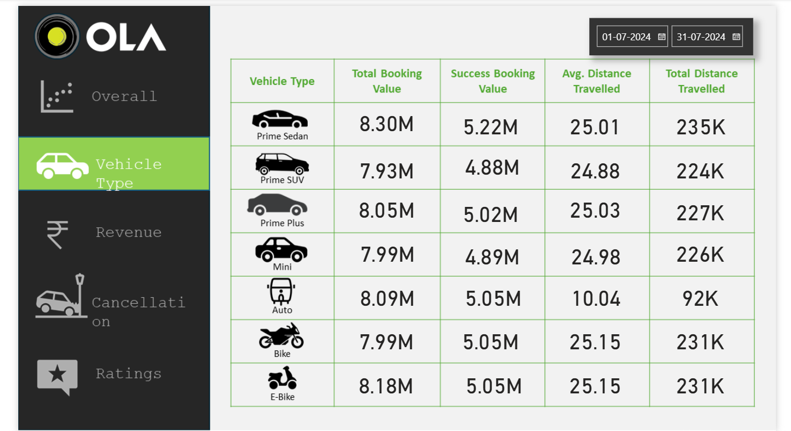
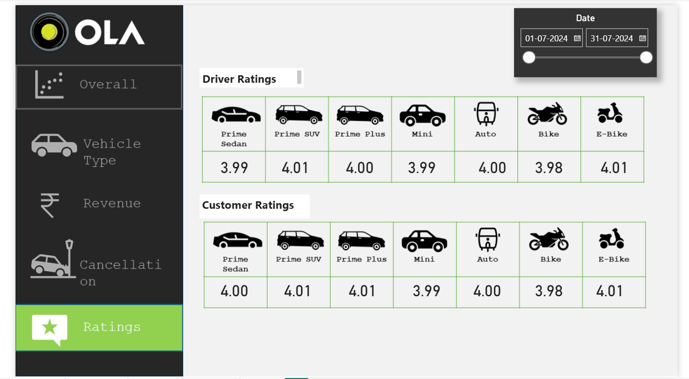

# 🚖 Ola Ride Data Analytics Project

## 📌 Project Overview
This is an **end-to-end data analytics project** on Ola rides. The workflow includes:  
- **Data Extraction & Preparation** using SQL  
- **Data Cleaning and Analysis**  
- **Interactive Dashboards** using Power BI  

The project provides insights into ride trends, customer behavior, driver performance, cancellations, and revenue.

---

## 🛠 Tools & Technologies
- **SQL** – Data extraction, aggregation, and analysis  
- **Power BI** – Dashboard creation and visualization  
---

## 📊 SQL Analysis Performed
Key queries executed:  
1. Retrieve all successful bookings  
2. Find the average ride distance for each vehicle type  
3. Get the total number of cancelled rides by customers  
4. List the top 5 customers who booked the highest number of rides  
5. Get the number of rides cancelled by drivers due to personal and car-related issues  
6. Find the maximum and minimum driver ratings for Prime Sedan bookings  
7. Retrieve all rides where payment was made using UPI  
8. Find the average customer rating per vehicle type  
9. Calculate the total booking value of rides completed successfully  
10. List all incomplete rides along with the reason  

---

## 📈 Power BI Dashboards
Interactive dashboards include:  
- **Ride Volume Over Time** – Track trends and patterns  
- **Booking Status Breakdown** – Completed, cancelled, or ongoing rides  
- **Top 5 Vehicle Types by Ride Distance** – Analyze vehicle usage  
- **Average Customer Ratings by Vehicle Type** – Measure satisfaction  
- **Cancelled Rides Reasons** – Understand why rides are cancelled  
- **Revenue by Payment Method** – Track revenue contributions  
- **Top 5 Customers by Total Booking Value** – Identify high-value customers  
- **Ride Distance Distribution Per Day** – Analyze daily ride distances  
- **Driver Ratings Distribution** – Monitor driver performance  
- **Customer vs Driver Ratings** – Compare satisfaction levels

## 📸 Power BI Dashboard Screenshots
Here are some key visuals from the dashboards:  

  
  
  


---

## 💡 Key Insights
- Most rides are **successfully completed**, with cancellations mainly due to **personal or car issues**.  
- Certain **vehicle types** have higher average distances and generate more revenue.  
- **Customer and driver ratings** provide actionable feedback.  
- Top customers contribute significantly to overall revenue, highlighting the importance of **loyalty programs**.  

---

## 📂 Project Files
- `olarides.sql` – SQL scripts for data extraction and analysis  
- `OlaDataAnalysis.pbix` – Power BI dashboards file  
- `README.md` – Project description and instructions  
- `images/` – Folder containing dashboard screenshots  
---

## 🚀 How to Use
1. Clone the repository:  
   ```bash
https://github.com/kajal0820/Ola-Data-Analysis-Dashboard
